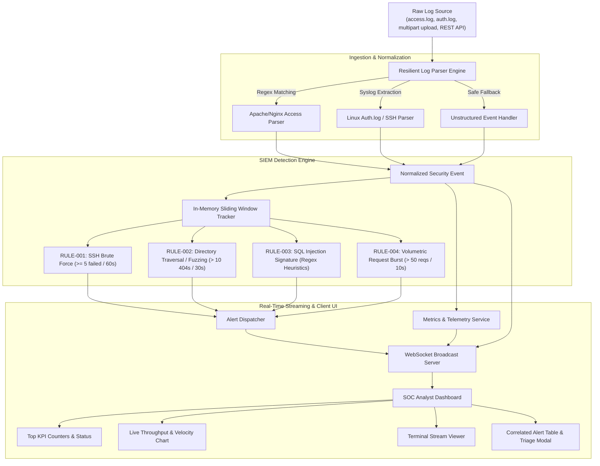

# 🛡️ SentinelLog - Real-Time SIEM & Log Ingestion Dashboard

**SentinelLog** is a lightweight, high-performance Security Information and Event Management (SIEM) log ingestion and correlation engine built with **Node.js**, **Express**, **Native WebSockets (`ws`)**, and a **modern dark-mode SOC analyst dashboard**.

It provides real-time streaming ingestion for web access logs and authentication syslogs, in-memory sliding-window threat correlation, automated attack simulation, and incident triage with actionable firewall mitigations.

---

## 🏗️ Architecture & Pipeline Overview



---

## ⚡ SIEM Correlation Rule Specifications

| Rule ID | Threat Classification | Severity | MITRE ATT&CK Mapping | Trigger Condition | Window | Automated Mitigation |
| :--- | :--- | :--- | :--- | :--- | :--- | :--- |
| **`RULE-001`** | **SSH Brute Force Attack** | <span style="color:#f43f5e;font-weight:bold">HIGH</span> | `T1110.001` (Password Guessing) | $\ge 5$ failed login attempts from a single source IP | 60s | `iptables -A INPUT -s <IP> -p tcp --dport 22 -j DROP` |
| **`RULE-002`** | **Directory Traversal & Fuzzing** | <span style="color:#f59e0b;font-weight:bold">MEDIUM</span> | `T1083` (File Discovery) / `T1190` | Traversal sequences (`../`, `win.ini`, `/etc/passwd`) **OR** $>10$ `404 Not Found` responses | 30s | `ufw deny from <IP>` / Block path on WAF |
| **`RULE-003`** | **SQL Injection Exploitation** | <span style="color:#f43f5e;font-weight:bold">HIGH</span> | `T1190` (Exploit Public-Facing App) | SQLi payloads (`UNION SELECT`, `' OR 1=1`, `--`, `INFORMATION_SCHEMA`) | Instant | Parameterize query endpoints & blacklist IP on WAF |
| **`RULE-004`** | **High-Frequency Request Burst** | <span style="color:#06b6d4;font-weight:bold">LOW / INFO</span> | `T1498` (Network Denial of Service) | $>50$ HTTP requests from a single origin IP | 10s | Apply Nginx token-bucket rate limiting (`limit_req_zone`) |

---

## 🚀 Getting Started

### Prerequisites
- **Node.js** (v18.0.0 or higher)
- **npm** (v9.0.0 or higher)

### Installation & Launch

1. **Install dependencies:**
   ```bash
   npm install
   ```

2. **Run the automated test suite:**
   ```bash
   npm test
   ```

3. **Start the SentinelLog server:**
   ```bash
   npm start
   ```

4. **Access the Dashboard:**
   Open your browser to:
   ```
   http://localhost:3000
   ```

---

## 📡 REST API & WebSocket Endpoints

### REST API

- `POST /api/logs/ingest`: Accepts raw log strings via JSON body (`{ "logs": "..." }`) or multipart form file upload (`file`).
- `POST /api/simulate`: Triggers an automated cyber attack simulation scenario.
  ```json
  {
    "scenario": "ssh-brute-force" // Options: "ssh-brute-force", "sql-injection", "directory-traversal", "endpoint-fuzzing", "ddos-burst", "multi-vector"
  }
  ```
- `GET /api/alerts`: Returns recent correlated alerts history with optional filtering (`?severity=High&limit=50`).
- `GET /api/metrics`: Returns aggregated metrics, EPS throughput history, and top threat IP rankings.
- `GET /api/scenarios`: Returns available pre-scripted simulation scenarios.
- `POST /api/reset`: Resets dashboard state, alerts buffer, and metrics counters.

### WebSocket Stream (`ws://localhost:3000/ws`)

Connect to `ws://localhost:3000/ws` for real-time bi-directional streaming:
- Receives `INIT_STATE` snapshot upon connection.
- Receives `LOG_INGESTED` events for live terminal streaming.
- Receives `ALERT_TRIGGERED` payloads containing correlated threat evidence.
- Receives `METRICS_UPDATE` periodic telemetry every second.

---

## 📁 Project Directory Structure

```
.
├── server.js                     # Express server & native WebSocket attachment
├── package.json                  # Dependencies and test runner script
├── README.md                     # Documentation, rule specs & resume bullets
├── src/
│   ├── parser/
│   │   └── logParser.js          # Apache/Nginx combined & Syslog regex parsers
│   ├── engine/
│   │   ├── slidingWindow.js      # In-memory sliding time window state tracker
│   │   └── detectionEngine.js    # SIEM correlation rules (RULE-001 - RULE-004)
│   ├── simulation/
│   │   └── attackSimulator.js    # Pre-scripted cyber attack scenario generator
│   ├── routes/
│   │   └── apiRoutes.js          # REST API endpoints
│   └── services/
│       ├── metricsService.js     # SOC metrics & velocity calculator
│       └── broadcastService.js   # WebSocket client connection manager
├── public/
│   ├── index.html                # Modern Dark-Mode SOC Analyst Dashboard UI
│   ├── css/
│   │   └── custom.css            # CRT scanline, glassmorphism & syntax styling
│   └── js/
│       └── dashboard.js          # Frontend event streaming, Chart.js & triage logic
├── samples/
│   ├── auth.log                  # Linux authentication test fixture
│   ├── access.log                # Apache/Nginx web access test fixture
│   └── mixed_attacks.log         # Combined APT multi-vector fixture
└── test/
    ├── parser.test.js            # Parser unit tests & malformed input resilience
    ├── detectionEngine.test.js   # SIEM correlation rule tests & sliding window tests
    └── api.test.js               # REST API integration tests
```

---

## 💼 Ready-to-Use Resume Bullet Points

- **Engineered SentinelLog**, a real-time SIEM and log ingestion pipeline in Node.js and WebSockets capable of parsing and correlating streaming logs with sub-millisecond latency.
- **Implemented in-memory sliding-window correlation algorithms** detecting multi-stage threats including SSH brute-force attacks ($\ge 5$ attempts / 60s), directory traversal/fuzzing, SQL injection signatures, and traffic bursts.
- **Designed a resilient log parsing engine** supporting Apache/Nginx Combined and Linux Syslog formats with automated schema detection, URI decoding, and safe error-handling for malformed inputs.
- **Constructed a real-time dark-mode SOC analyst dashboard** with Chart.js visualizations, live velocity telemetry (EPS), interactive incident triage modals, and automated firewall remediation generation (`iptables`/`ufw`).
- **Authored a comprehensive test suite (30 unit & integration tests)** verifying rule trigger precision, temporal boundary conditions, and false-positive prevention under concurrent load.
